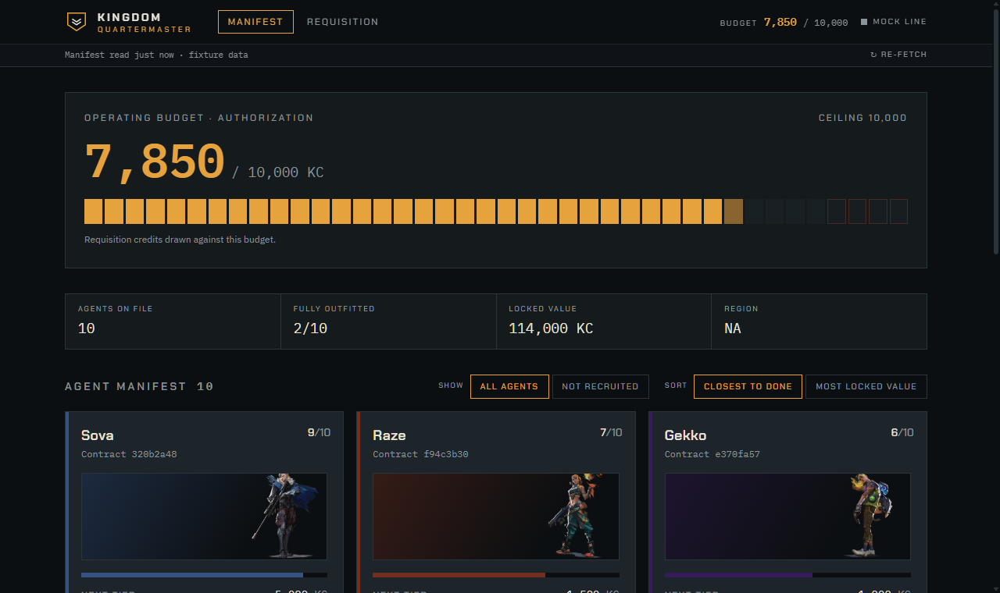
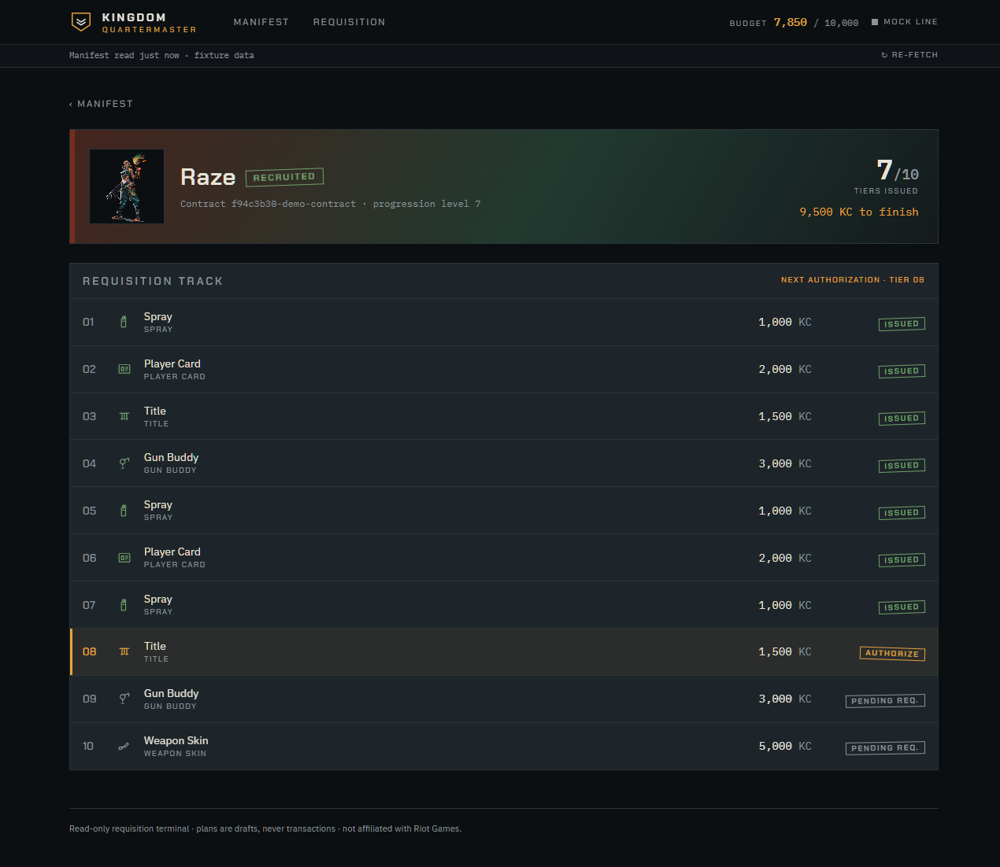
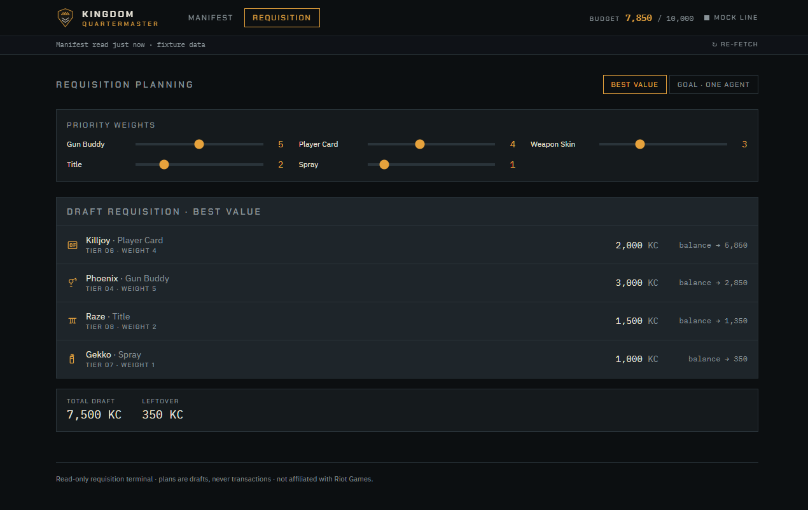
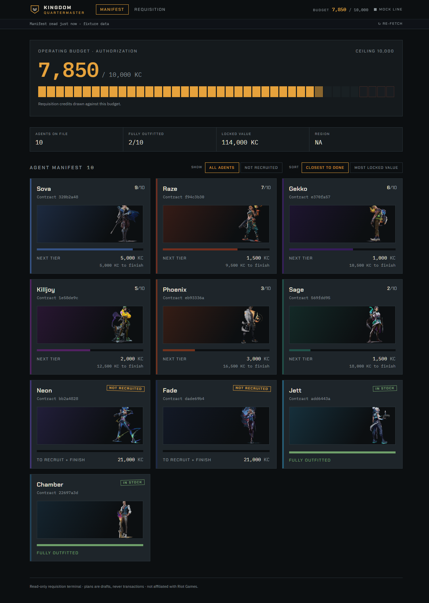
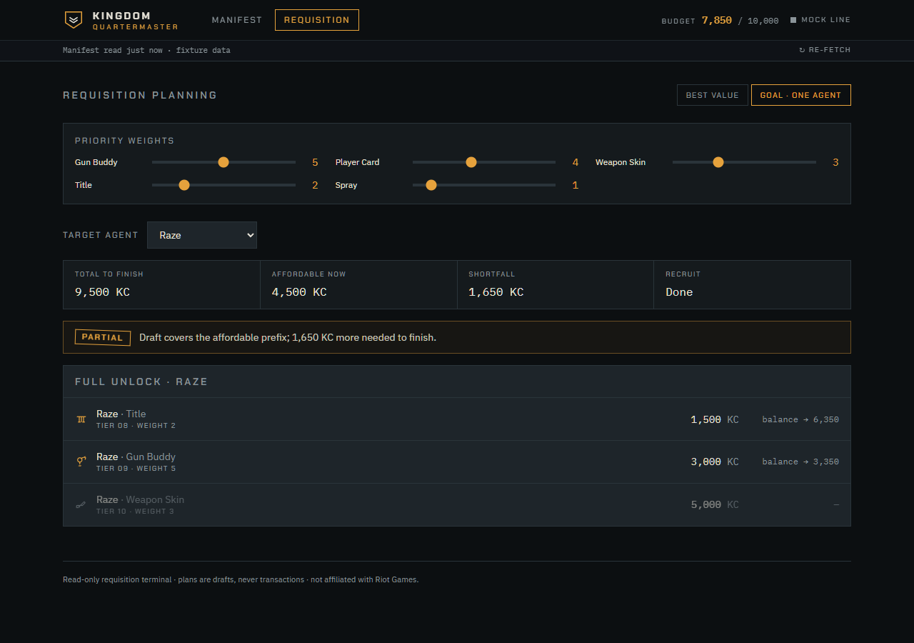
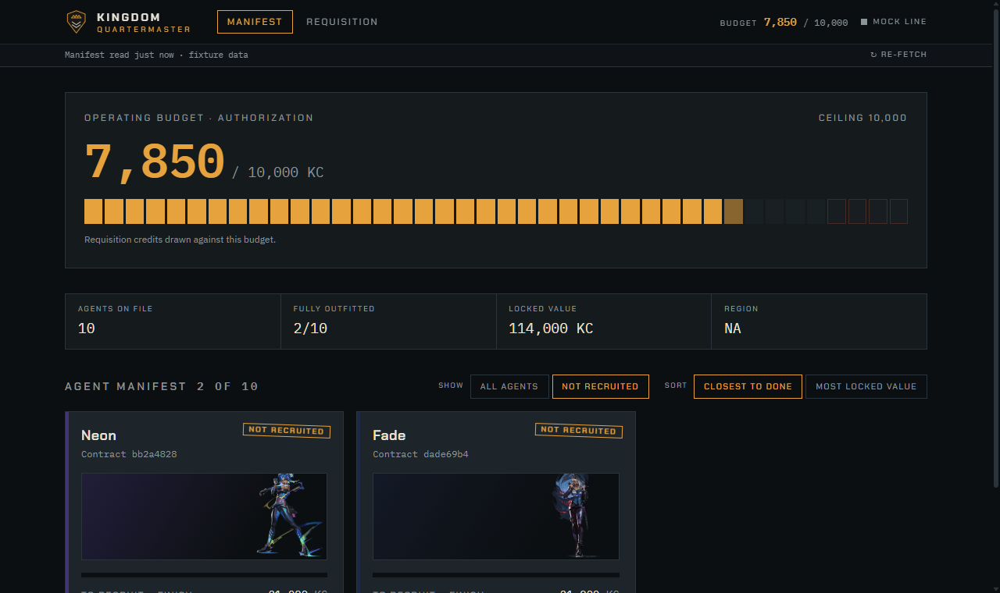
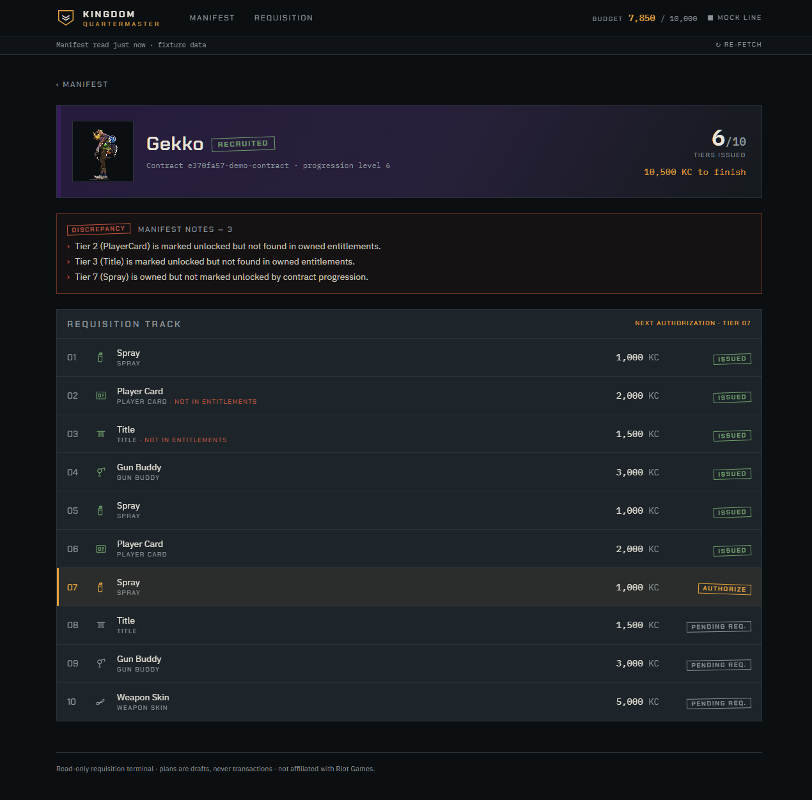
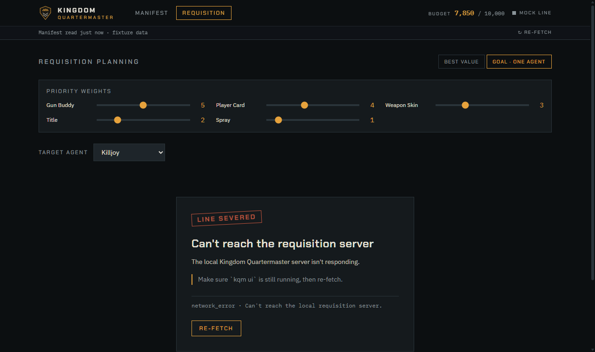

<h1 align="center">Kingdom Quartermaster</h1>

<p align="center"><em>Kingdom Corporation keeps the ledger. The Quartermaster issues the gear.</em></p>

<p align="center">
  <a href="https://github.com/m4d4g4sk4r/Kingdom-QuarterMaster/actions/workflows/ci.yml"></a>
  
  
  
</p>

<p align="center">
  A local, <strong>read-only</strong> tracker for your VALORANT agent gear — as a CLI
  <em>and</em> a web UI. See which contract rewards you've unlocked, what the locked
  tiers cost in Kingdom Credits (KC), and where your next credits are best spent.
</p>

<p align="center">
  
</p>

> [!NOTE]
> Not endorsed by or affiliated with Riot Games. It uses unofficial, undocumented
> client APIs, is read-only, and may break after any game patch. Use at your own risk.

## Features

- **Read-only, always.** Every request is an HTTP `GET`; it never buys, activates, or edits anything.
- **No credentials.** Authenticates against the local Riot Client via its lockfile — no username or password, ever.
- **Two front-ends, one core.** A `rich` CLI and a local web UI share the same data path.
- **Best-value planning.** Greedy recommendations by value-per-credit, plus a goal mode that costs out a full agent unlock.
- **Try it without VALORANT.** `--mock` serves a bundled demo roster, so you can look around with nothing installed.

## Screenshots

<p align="center">
  
</p>
<p align="center"><sub><b>Agent detail</b> — the contract as a ten-tier track: issued, the one tier cleared to authorize next, then pending.</sub></p>

<p align="center">
  
</p>
<p align="center"><sub><b>Requisition planner</b> — a best-value draft with the running balance drawn down line by line. Weights re-draft it live.</sub></p>

<details>
<summary><b>More views</b></summary>

<p align="center">
  
</p>
<p align="center"><sub>The full manifest — sort by closest-to-done or most locked value.</sub></p>

<p align="center">
  
</p>
<p align="center"><sub>Goal mode — total to finish, what's affordable now, and the shortfall for one agent.</sub></p>

<p align="center">
  
</p>
<p align="center"><sub>Filter down to the agents you haven't recruited yet.</sub></p>

<p align="center">
  
</p>
<p align="center"><sub>Discrepancy notes — when contract progression and your entitlements disagree (usually an unverifiable reward, not an account problem).</sub></p>

<p align="center">
  
</p>
<p align="center"><sub>Every failure has a clear, in-character screen — never a blank page or a stack trace.</sub></p>

</details>

## Install

Use a virtual environment so the pinned versions in `pyproject.toml` are what get installed:

```bash
py -3 -m venv .venv
./.venv/Scripts/activate      # Windows — use `source .venv/bin/activate` on macOS/Linux
pip install -e .              # add the web UI:  pip install -e ".[ui]"
```

VALORANT (or the Riot Client) must be **running and logged in** on the same machine.
Windows is the primary supported platform; Python 3.10+.

## Usage

```bash
kqm status                    # unlocked/locked counts, KC balance, discrepancies
kqm locked                    # every locked reward, per agent, with KC cost
kqm unlocked                  # every already-unlocked reward
kqm recommend                 # best-value purchase plan for your balance
kqm recommend --goal Gekko    # cheapest path to fully unlock one agent
kqm ui                        # open the web UI at http://127.0.0.1:8420
kqm ui --mock                 # …with a demo roster, no VALORANT needed
```

Pass `--shard na` if region auto-detection fails, and `--refresh-static` to rebuild
the on-disk game-data cache. The web UI also serves API docs at `/docs`.

## Configuration

Optional JSON at your platform config dir (e.g. `%APPDATA%\kingdom-quartermaster\config.json`):

```json
{
  "shard": "na",
  "reward_weights": { "buddy": 5, "playercard": 4, "skin": 3, "title": 2, "spray": 1 },
  "agent_recruit_cost_kc": 8000
}
```

Higher weight = worth more to you; the planner ranks tiers by `weight / KC cost`.
Override per run with `--weight kind=value` (repeatable). No token, password, or
username is ever written to disk — only the game-data cache and these preferences.

## How it works

Authentication is lockfile-only against the local Riot Client. The only network
destinations are Riot's own local/player endpoints and [valorant-api.com](https://valorant-api.com/)
(public static game data). No telemetry, no remote login.

```
src/kqm/
  __main__.py     CLI entry (status, locked, unlocked, recommend, ui)
  auth.py         lockfile discovery, local token fetch, shard detection
  riot_client.py  GET-only pd.pvp.net client
  static_data.py  valorant-api.com fetch + on-disk cache
  reconcile.py    pure: live progression + static tiers -> per-agent model
  recommend.py    pure: greedy plan / goal-mode plan
  service.py      fetch_snapshot() — one orchestration path for CLI + web API
  webapp.py       127.0.0.1-only FastAPI app; serves the built SPA + JSON API
  webui/          built web UI (shipped as package data)
frontend/         Vite + React + Tailwind source (dev/build only)
```

See [docs/ARCHITECTURE.md](docs/ARCHITECTURE.md) for the local-auth details and notes
on the undocumented Riot API.

## Development

```bash
pip install -e ".[dev]"       # ruff + pytest
pytest                        # fixture-based, no network access required
```

The web UI lives in `frontend/` (Vite + React + TypeScript + Tailwind); Node is only
needed to build it, never to run it.

```bash
cd frontend && npm install
npm run dev                   # Vite on :5173, proxies /api to kqm ui --mock
npm run build                 # rebuild the bundle into src/kqm/webui/
```

The design direction is documented in [frontend/DESIGN_BRIEF.md](frontend/DESIGN_BRIEF.md).

## Read-only guarantees

- No purchase, activate-contract, or any `POST`/`PUT` to a Riot player endpoint exists
  anywhere in this codebase — not even a disabled button in the UI. Plans are shopping lists.
- No username/password handling — lockfile auth only.
- No telemetry or analytics.

## Credits

- [valorant-api.com](https://valorant-api.com/) — public static game data.
- [valapidocs.techchrism.me](https://valapidocs.techchrism.me/) — community docs for the unofficial client API.

MIT licensed. Not a Riot Games product.
